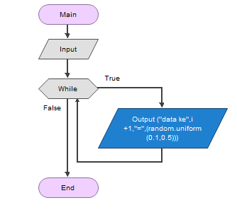
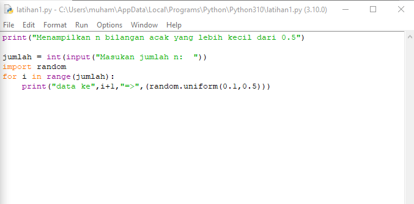
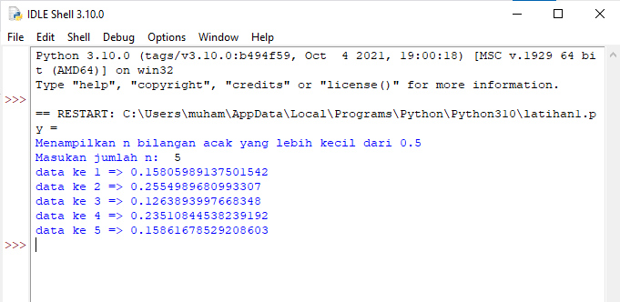

# Labspy03
# Latihan 1
## Membuat Prrogram Untuk Menampilkan n Bilangan Acak yang Lebih Kecil dari 0.5
### Flowchart program
- Berikut flowchart program dari program latihan 1, untuk menampilkan n bilangan acak yang lebih kecil dari 0.5

### Penjelasan alur program 
 > print("Menampilkan n bilangan acak yang lebih kecil dari 0.5") 
-  itu hanya perintah untuk menamilkan judul saja
 > jumlah = int(input("Masukan jumlah n: )) 
-  Adalah perinntah untuk menginputkan nilai n tersebut
 > import random
-  Adalah perintah untuk menginportkan built-in random yang telah tersedia di python
 > for in range (jumlah): 
-  Adalah perintah untuk, i sebagai integer dalam baris jumlah
 > print ("data ke",i+1,"=",(random.uniform(0.1,0.5))) 
-  Adalah perintah untuk menampilkan hasil yang telah di input dengan ketentuan random uniform mulai dari nilai 0.1 sampai 0.5

### Berikut gambaran programnya

### Berikut hasil program yang saya buat

### Latihan 1 selesai
_______________________________________________________________________________________________________________________________________
